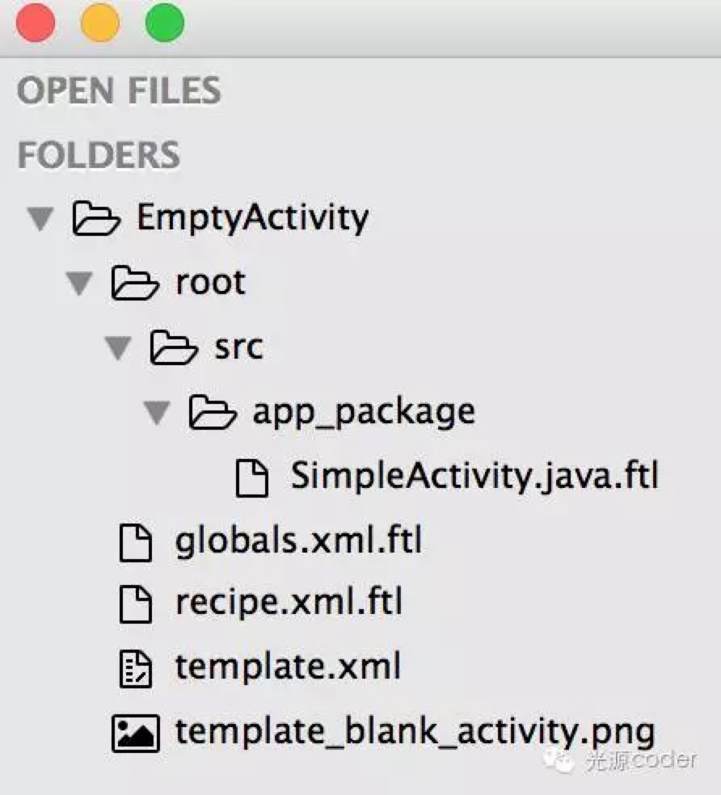
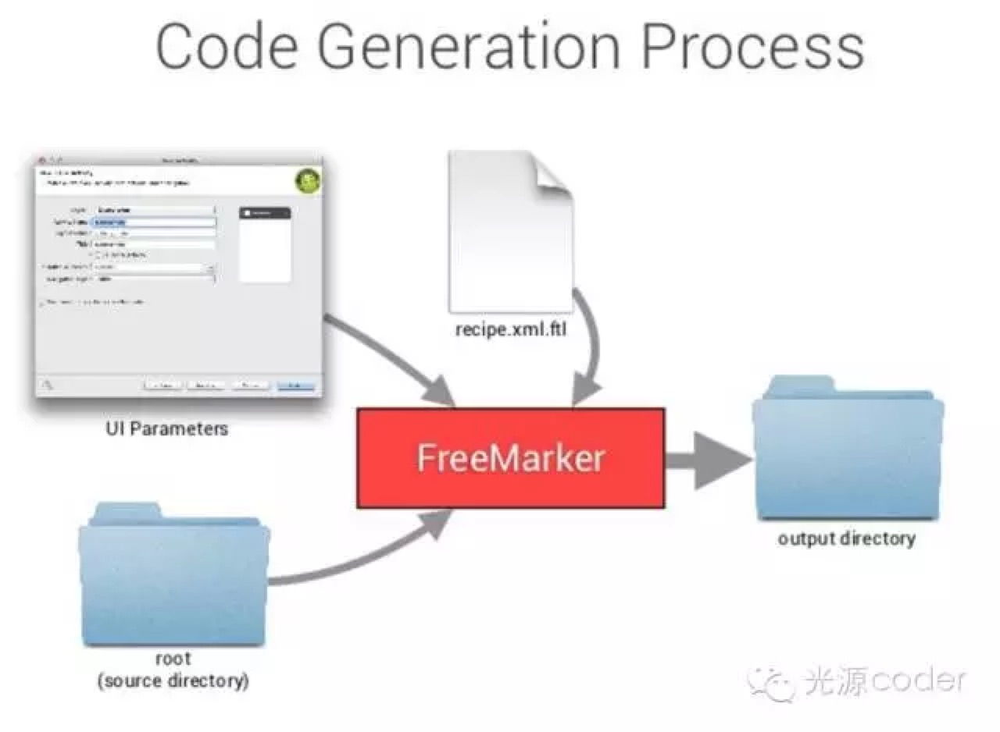

# Android 项目模版化

- [大幅提高Android开发效率之Android项目模板化（上）](http://mp.weixin.qq.com/s?__biz=MzI4NTQ2OTI4MA==&mid=2247483665&idx=1&sn=50f5232d29c9754c75e231fbb1632e85&chksm=ebeafe1edc9d77088f847d811dc7b95b69559c5f3928983924ea5fb6ed9029cf3b570985b541&mpshare=1&scene=1&srcid=1107eSE2wThYUQo8EhuUSR1J#rd)
- [大幅提高Android开发效率之Android项目模板化（下）](http://mp.weixin.qq.com/s?__biz=MzI4NTQ2OTI4MA==&mid=2247483670&idx=1&sn=351d679432065fed563a67b68da2bb3b&chksm=ebeafe19dc9d770f9919840d032bb8e4c9b026bf1a6c9583daf08bbb21d5fdcfedfb4a0ac441&mpshare=1&scene=1&srcid=1111PA3WHe9ae9lHuYh2Guw8#rd)


## 模板文件

1. 模板路径

- win：`/plugins/android/lib/templates/`
- mac: `Android Studio.app/Contents/plugins/android/lib/templates/`




#### 从上图我们可以看到 EmptyActivity 模板有以下文件：

- globals.xml.ftl
- recipe.xml.ftl
- template.xml  - 整个模板的定义
- template_blank_activity.png
- root/src/app_package/SimpleActivity.java.ftl


### template.xml

```xml
<?xml version="1.0"?>
<template
    format="5"
    revision="5"
    name="Empty Activity"
    minApi="7"
    minBuildApi="14"
    description="Creates a new empty activity">

    <category value="Activity" />
    <formfactor value="Mobile" />

    <parameter
        id="activityClass"
        name="Activity Name"
        type="string"
        constraints="class|unique|nonempty"
        suggest="${layoutToActivity(layoutName)}"
        default="MainActivity"
        help="The name of the activity class to create" />

    <parameter
        id="generateLayout"
        name="Generate Layout File"
        type="boolean"
        default="true"
        help="If true, a layout file will be generated" />

    <parameter
        id="layoutName"
        name="Layout Name"
        type="string"
        constraints="layout|unique|nonempty"
        suggest="${activityToLayout(activityClass)}"
        default="activity_main"
        visibility="generateLayout"
        help="The name of the layout to create for the activity" />

    <parameter
        id="isLauncher"
        name="Launcher Activity"
        type="boolean"
        default="false"
        help="If true, this activity will have a CATEGORY_LAUNCHER intent filter, making it visible in the launcher" />
    
    <parameter
        id="packageName"
        name="Package name"
        type="string"
        constraints="package"
        default="com.mycompany.myapp" />

    <!-- 128x128 thumbnails relative to template.xml -->
    <thumbs>
        <!-- default thumbnail is required -->
        <thumb>template_blank_activity.png</thumb>
    </thumbs>

    <globals file="globals.xml.ftl" />
    <execute file="recipe.xml.ftl" />

</template>

```

1. `template` 标签，整个 `xml` 的根节点，其中 name属性为模板名称，`description`属性为模板的描述。
2. `category`标签，定义了模板所属的分类，即图四中的分类列表中的分类，分类名一样的模板会被归纳到同一目录下。
3. `parameter` 标签，定义了模板输入弹窗中的输入参数，每个 `parameter` 为一行。其中：
	- `id` 属性为参数唯一标识，我们可以在代码中通过 id来使用该参数。
	- `name` 属性为参数名称，显示在输入控件的前面或后面。
	- `type`属性为参数类型，根据该属性和`constraints`属性的值综合比较后参数会被渲染成不同的输入形式，比如 `string` 类型会显示输入框，而 `boolean`类型会显示一个选择框。
	- `constraints`属性为输入约束，常见的有`class`，代表类名；`layout`代表布局名；`package` 代表包路径； `unique`则是不能与现有的重复；`nonemptye`表示不能为空。
	- `suggest` 和 `default`标签，前者是建议名称，后者是默认名称，前者优先级高于后者。
	- `help`属性是参数输入提示，当该参数获取焦点后，对应的帮助信息会显示在对话框上。

4. `thumbs`标签定义了该目标的缩略图，这也就是`template_blank_activity.png`文件的作用了。
5. `globals`标签指定了 `global` 文件，具体用途下文会具体说明。
6. `execute`标签，跟字面上的意思一样，执行 `recipe.xml.ftl`文件的内容，将模板文件生成具体的可用文件。

### globals.xml.fl

```xml
<?xml version="1.0"?>
<globals>
    <global id="hasNoActionBar" type="boolean" value="false" />
    <global id="parentActivityClass" value="" />
    <global id="simpleLayoutName" value="${layoutName}" />
    <global id="excludeMenu" type="boolean" value="true" />
    <global id="generateActivityTitle" type="boolean" value="false" />
    <#include "../common/common_globals.xml.ftl" />
</globals>
```
整个文件很简单，用 `global` 标签定义了一系列的全局参数（这里的全局是指可以在其他模板文件中使用它们）供具体的模板文件使用，`id`为唯一标识，`type`为类型，`value`为参数值。

至于`#include`标签的作用，相信大家能猜到一点，与 `xml` 文件中的 `include`作用是一致的，包含其他文件内容到本文件中。包含的这个文件具体内容我就不贴出来了，也是一堆定义好的参数，感兴趣的可以打开对应的文件看看。

总结一下，`globals.xml.fl`文件的作用就是定义或引入一些变量（参数）供后续模板文件使用。

## Android Studio Template 的工作原理



如图所示，整个模板是以 `FreeMarker` 引擎为基础工作。其中，`globals.xml.ftl`和模板的输入参数弹窗（` template.xml` 中定义的
`parameter` 标签）相当于声明参数和定下参数值，再执行 `recipe.xml.fl` 中定义好的命令，将 `SimpleActivity.java.ftl` 转化为 `SimpleActivity.java`。转化过程中自然免不了使用定义好的参数。

#### 说到这里，我们知道了 recipe.xml.ftl 文件的作用就是定义模板转化的命令。看看具体文件内容：

```xml
<?xml version="1.0"?>
<recipe>
    <#include "../common/recipe_manifest.xml.ftl" />

<#if generateLayout>
    <#include "../common/recipe_simple.xml.ftl" />
    <open file="${escapeXmlAttribute(resOut)}/layout/${layoutName}.xml" />
</#if>

    <instantiate from="root/src/app_package/SimpleActivity.java.ftl"
                   to="${escapeXmlAttribute(srcOut)}/${activityClass}.java" />

    <open file="${escapeXmlAttribute(srcOut)}/${activityClass}.java" />
</recipe>
```

首先，`<#include>`标签那行表示包含了 `recipe_manifest.xml.ftl` 文件的内容，打开对应文件后会发现里面是 `<merge>` 标签，作用是将定义的 `manifest.xml.ftl` 文件转化为 `manifest.xml`后与项目中的 `AndroidManifest.xml` 文件合并（可以参考安卓开发中 `xml` 文件中的 `merge` 标签）。

也就是通过 `merge` 标签，我们可以自定义一个同名文件，然后与项目中的文件合并。这里是完成了 `Activity` 在 `AndroidManifest.xml` 文件中注册的工作。

然后下面的 `<#if>`标签代表的含义相信大家可以猜测出来。形如`<#if condition> </#if>`，是 `freeMarker` 模板中的`if`语句，前后成对出现，`condition`常见的有 `boolean`、`var == "content"`(判断变量的值)、`var??`（判断是否为空）等等。

有 `if` 当然少不了 `else`，形如`<#if condition> <#else> </#if>`。

`instantiate` 标签是 `recipe.xml.ftl` 文件的核心标签，它的作用是将 `from` 属性的 `ftl` 文件转化为 `to` 属性的文件。例如文件中就是将 `SimpleActivity.java.ftl` 文件转化为对应包下的 `${activityClass}.java` 文件。（这里的 `${activityClass}`是模板变量的表示方法，`activityClass` 变量由上文中的 `template.xml`定义，最后会被它的值填充）


最后，`open` 文件会打开对应的文件。

接下来上“主菜”，打开 `SimpleActivity.java.ftl` 看看：

```xml
package ${packageName};

import ${superClassFqcn};
import android.os.Bundle;

public class ${activityClass} extends ${superClass} {

    @Override
    protected void onCreate(Bundle savedInstanceState) {
        super.onCreate(savedInstanceState);
<#if generateLayout>
        setContentView(R.layout.${layoutName});
</#if>
    }
}
```

看起来就是一个普通的 `Java class` 文件，区别是多了一些 `FreeMarker` 标记。在 `recipe.xml.ftl` 文件定义的转化过程中，这些标记会被来自 `globals.xml.ftl` 和 `template.xml` 的参数填充为具体的值。

[MvpActivity](./_assets/MvpActivity.zip)

