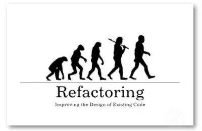
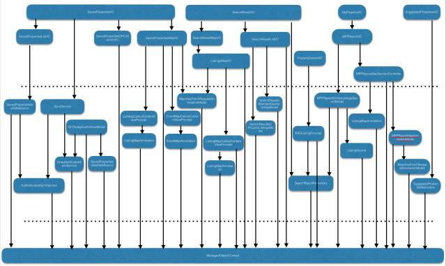
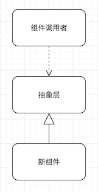
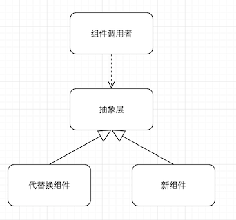
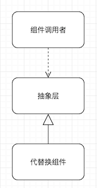
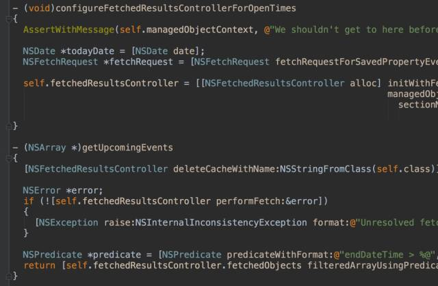
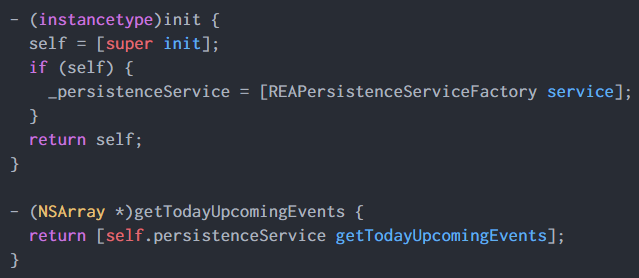
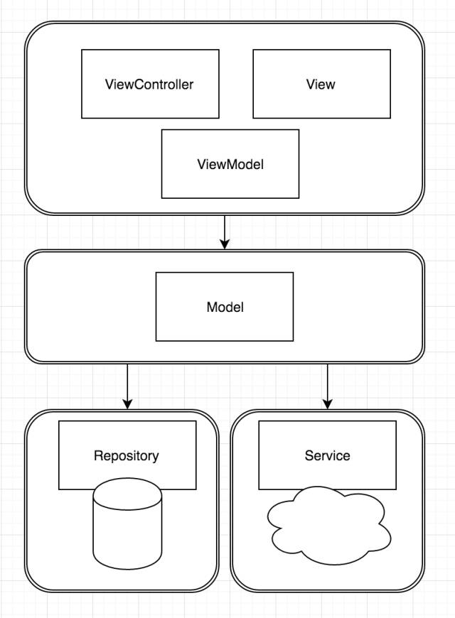

# [iOS遗留系统重构实践](https://mp.weixin.qq.com/s?__biz=MzA3ODg4MDk0Ng==&mid=2651112090&idx=1&sn=7e00d0da704f99ef93ffd815731f1fd9&scene=0&key=b28b03434249256bdbf499158ba9bee50d6f7f8988ae72b765cabff2fd636b2487ddc3fc1c8df3eeae6340005d085da8&ascene=0&uin=NTY3NzUyMjgw&devicetype=iMac+MacBookPro11%2C4+OSX+OSX+10.11.4+build(15E65)&version=11020201&pass_ticket=tFA3c19llodLY6oDpL0gxJRiDSpm6Nhwg404kgHc9IjeuJ0Dzr0bCEWwyieKCro3)



本文来自『移动开发前线』公众号。

> 嘉宾介绍

> 李剑，曾为ThoughtWorks高级咨询师，InfoQ敏捷社区首席编辑。在2013年之前，一直致力于敏捷思想在国内的推广传播。 译作有《实现模式》、《硝烟中的Scrum和XP》等。现居墨尔本，曾参与过Telstra、MyOB、realestate.com.au 等多款App的开发。


由于篇幅原因，群内分享的是精简后的版本，你可以[阅读原文](http://www.jianshu.com/p/d684693f1d77#rd '高速公路换轮胎——为遗留系统替换数据库')读到完整版本。

在过去的几个月内，我主导着团队完成了一项工程浩大（累积八个人月的工作量）的重构工作——为我们的App替换数据库。之所以能够把这种伤筋动骨的事情称之为重构，是因为在这段时间内，我们每天向主干合并两到三次代码，期间App上线五次，用户没有感知到任何影响。在这篇文章中，我将讲述我们如何在不影响系统外部行为，也不影响正常交付的情况下，替换掉了数据库实现。

# 背景


在一个有着良好分层结构的系统中，每一层都有它自己的职责：显示层负责响应用户事件，调用业务层的逻辑，最后做数据呈现；业务逻辑层负责业务规则与数据处理；数据访问层封装底层数据库的操作，网络访问层与其并列，负责网络请求、json解析等等。无论是MVC、MVVM、VIPER，归根结底都是在”单一职责“、“关注点分离”、“高内聚低耦合”的原则下变化，只是表现形式和涵盖的层次各异。

而在我们的代码中，几乎所有的显示层对象，包括ViewController、ViewModel，甚至View里面都混杂了大量的CoreData API调用，直接进行数据库操作。

粗略统计了一下，系统中一共有25个类与NSManageContext紧紧耦合。形成了下图中混乱的局面：



面对这种情况，我们首先要做的就是解耦。

# 方案选型

我们最先排除掉的是重写这种简单粗暴的方式。表面上看来，我们可以通过重写得到一个干净利落的方案，层次结构清晰，职责分离；但与之相伴的是巨大的风险：

范围不可控——遗留系统的难点就在于牵一发而动全身，影响范围极广。稍不留神，重写的工作就会如野火燎原般蔓延开来，不可收拾。

长时间无法上线——在整个过程中，直到最后完成的那一刻之前，系统会处于一直不可用的状态。漫长的时间里，所有的新功能都被阻塞，不能交付。没有哪个产品团队能承担这样的结果。

第二个被排除掉的方案是特性分支。把重写的工作放到分支上完成，其他人继续在主干上开发新特性，直到重写结束再合并回主干——这种做法确实比直接重写要好上那么一点点，因为新特性还是可以不受影响的；但长期没有跟主干合并的分支，在经历上四五个月的重写之后，天知道到最后要花多长时间来处理合并冲突？

既想减小对系统的影响，又想不影响新功能上线，又不想处理大量的合并冲突，最后的方案就只剩下了一种，那就是抽象分支（Branch by Abstraction）+特性开关（Feature Toggle）。

## 抽象分支

抽象分支这个名字的缘起是针对版本库分支而言的，它允许开发者在一条“抽象”的分支上并行工作，无需创建一条实际的分支，从而避免无谓的合并开销。

`Martin Fowler`和`Jez Humble`都曾在多年前撰文介绍过这个重构方案

- http://martinfowler.com/bliki/BranchByAbstraction.html

- http://continuousdelivery.com/2011/05/make-large-scale-changes-incrementally-with-branch-by-abstraction/

它的工作原理很简单：当我们想要替换掉系统中的某个组件——名为X——时，首先为X组件创造一个抽象层，这一层里面可能会有大大小小若干接口或是协议，把系统中对X组件的访问都隔离在抽象层之下，系统只调用抽象的接口/协议，不会接触到具体的API实现。如下图所示。



这一步我们可以通过提取方法、提取类和接口等重构手法来完成；这以后系统就彻底跟X组件解耦了，它依赖的只是一组抽象接口，而非具体实现。这时候，我们就可以着手在这个抽象层下面，进行新组件的开发工作，让它也实现同一套接口即可。



这之后，我们再使用特性开关（其原理及实现见下节），让这个抽象层在生产环境下调用旧组件，测试环境下调用新组件，从而在完全不影响交付的情况下，完成对新组件的测试。测试结束后，就可以打开开关，让系统在线上使用新组件，等彻底稳定后，把开关代码和旧组件代码全部删掉，替换工作就完成了。



在上述整个开发过程中，任何一个阶段都可以做到细粒度的任务分解，然后小步提交，每次提交都自动触发单元测试和集成测试，保证不影响现有功能。在频繁提交的情况下，也不会出现大量的代码合并冲突，无论是做组件替换还是新特性开发，开发人员都可以基于同一套代码库工作。这就大大减少了对系统的冲击和交付风险。

## 特性开关

先看一段代码：

```objective-c
+ (UIStoryboard *)searchResultsStoryboard
{
	NSString *storyBoardName;
	if([REAToggle shouldDisplayNewSearchResultsScreen])
	{
		storyBoardName = @"SearchResultsNewStoryBoard";
	}
	else
	{
		storyBoardName = @"SearchResultsStoryBoard";
	}
	
	UIStroryboard *storyboard= [UIStroryboard storyboardWithName:storyBoardName bundle:nil];
	
	return storyboard;
}
```

在这个例子中，我们要替换一个Storyboard的布局和相关ViewController的功能，耗时很久，如果直接在主干上修改，就会直接影响到现有的App，在功能完成之前都无法上线；如果拉一条分支出来做，未来就又会有大量的合并冲突。使用如上的特性开关就会避免上述问题。

当shouldDisplayNewSearchResultsScreen的值返回为真，就使用新的Storyboard，返回为假，就使用旧的Storyboard。这样一来，只要开关处于关闭状态，未完成的功能就是对用户不可见的，我们就既可以在开发环境下自测，也可以部署到测试环境下做验收测试，还可以针对开关为真的情况写对应的单元测试，让每次代码提交都有持续集成验证。这期间还可以继续发布新版本，用户完全感知不到影响，直到我们决定打开开关为止。

特性开关可以有多种实现方式。

- 预编译参数

在预编译参数中传值，让不同的xcconfig文件传入不同的值，然后在代码中做判断。
我们系统中绝大部分的特性开关都是用这种方式实现的。

- NSUserDefaults

有些功能可能对App有破坏性的影响，即便是设成只对Internal Target可见，也会影响到QA的回归测试。我们给Internal Target做了个Developer Settings界面，让开发人员可以自己修改开关状态，把开关的值存放在NSUserDefaults里面，默认返回false，只有在界面上手工切换之后才会返回true。测试和开发互相不受影响。
我们向Realm迁移的特性开关使用的就是这种方式。

- A/B测试

还有一个办法是使用第三方的A/B测试服务，如果缺少后台开发人员的话，这也是一个选择。但第三方的稳定性往往就会成为制约因素，Parse为推送通知提供过A/B测试服务，但是它到了17年就会被关闭了；我们用Amazon的A/B测试框架用了一段时间，然后Amazon也宣布今年8月份停用……目前我们还在寻找备选方案。

# 具体实现

在具体落实抽象分支和特性开关的时候，一共分成了如下几个阶段：

## 建立数据访问层

我们首先把跟数据请求有关的操作从ViewController中提取成一个方法，放到另一个对象中实现，以便日后替换。然后把所有的数据访问的方法都提取成一个协议，让数据层之上的对象都依赖于这个协议，而不是具体对象。这样一来，原先的ViewController就从下图中的样子：



变成了这样：



## 为数据对象提取协议

除了数据访问的代码以外，我们还把所有的数据对象上的公有属性和方法都提取了相应的协议，然后修改了整个App，让它使用协议，而不是具体的数据对象。这也是为以后的切换做准备。

## 使用Realm实现

前两步完成之后，我们就建立起了一个完整的抽象层。在这层之上，App里已经没有了对CoreData和数据对象的依赖，我们可以在这层抽象之下，提供一套全新的实现，用来替换CoreData。

在实现过程中，我们还是遇到了不少需要磨合的细节，比如Realm中的一对多关联是通过RLMArray实现的，并不是真正的NSArray，为了保证接口的兼容性，我们就只能把property定义为RLMArray，再提供一个NSArray的getter方法。种种问题不一而足。

## 切换开关状态

上篇文章说到，我们在迁移过程中的特性开关是用NSUserDefaults实现的，在界面上手工切换开关状态。这样的好处是开发过程不会影响在Hockey和TestFlight上内部发布。直到实现完成后，我们再把开关改成

```objective-c
+ (BOOL)shouldUseRealm
{
  return isInternalTarget;
}
```

让测试人员可以在真机上测试。回归测试结束之后，再让开关直接返回true，就可以向App Store提交了。

## 数据迁移

这个无需多说，写个MigrationManager之类的类，用来把数据从CoreData中读出，写到Realm里面去。这个类大概要保留上三四个版本，等绝大部分用户都已经升级到新版本之后才会删掉。

## 后续清理

特性开关是不能一直存活下去的，否则代码中的分支判断会越来越多。我们一般都会在上线一两个星期之后，发现没有出现特别严重的crash，就把跟开关有关的代码全都删掉。

在第一步建立数据访问层的时候，我们创建出了一个特别庞大的PersistenceService，它里面含有所有的数据访问方法。这只是为了方便切换而已，切换完成后，我们还是要根据访问数据的不同，建立一个个小的Repository，然后让ViewModel对象访问Repository读写数据，把PersistenceService删掉。

最后形成的架构如图所示：




# 总结

## 首先，要勇敢

面对遗留代码库，团队里一定要有人站出来跟大家说，我们不能让代码继续腐烂下去，我们要有清晰的目标和正确的策略，在重构中让优秀的设计渐渐涌现。这才是正途。

## 要有正确的方法

在遗留代码中工作，Long-Term Refactoring是不可或缺的。人们需要预见到在未来的产品规划中，哪些组件应当被替换，哪部分架构需要作出调整，把它们放到迭代计划里面来，当做日常工作的一部分。抽象分支和特性开关在Long-Term Refactoring可以发挥显著的效果，它们是持续交付的保障。

## 设计会过时，但设计原则不会

很多技术决策都不是非黑即白的，它们更像是在种种约束下做出的权衡。时光会褪色，框架会过时，脱离了具体场景，今天的优秀设计也会沦落成明天的遗留代码，但设计原则有着不动声色的力量。我们无法预见未来，只能根据当前的情况做出简单而灵活的设计。这样的设计应当服从这些设计原则：单一职责、关注点分离、不要和陌生人说话……让我们的代码尽可能保持高内聚低耦合，保证良好的可测试性。